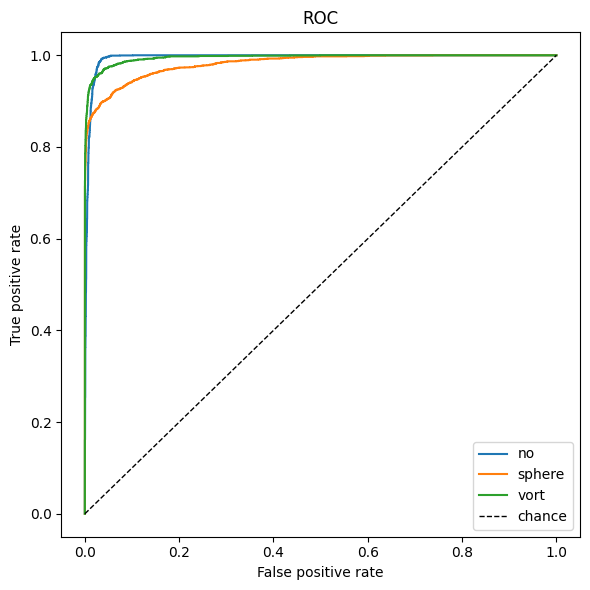
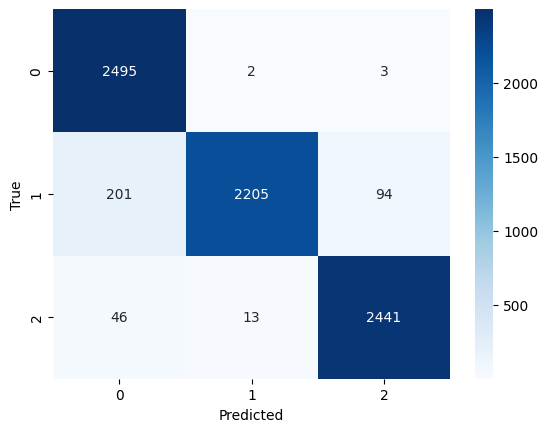
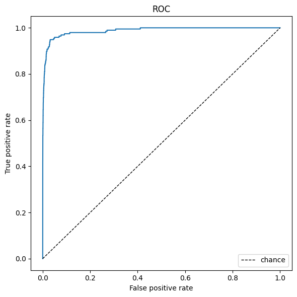
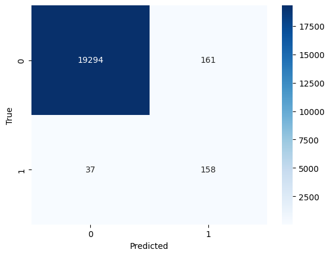

# ML4SCI DeepLense — GSoC 2026 

This repository contains solutions for **[ML4SCI](https://ml4sci.github.io/)** (Machine Learning for Science) **[GSoC 2026](https://ml4sci.github.io/activities/gsoc2026.html)** application tests under the **DeepLense** project.

---

## Test I 

**Goal:** Classify lens images into **no substructure**, **subhalo (“sphere”)**, or **vortex** substructure.

**Ablation summary:**

These metrics are computed on the **train folder (train/val split)**.

| Configuration | val_loss | val_auroc_no | val_auroc_sphere | val_auroc_vort | val_acc_no | val_acc_sphere | val_acc_vort |
|---------------|---------:|-------------:|-----------------:|---------------:|-----------:|---------------:|-------------:|
| ResNet-18 baseline | 0.281 | 0.989 | 0.968 | 0.987 | 0.967 | 0.877 | 0.923 |
| + affine | **0.134** | **0.996** | 0.985 | 0.995 | **1.000** | 0.878 | **0.972** |
| + affine + noise (σ=0.01) | 0.246 | 0.988 | 0.957 | 0.978 | 0.997 | 0.821 | 0.909 |

**Takeaway:** Just using affine augmentations give the largest gain.

**Results:**

The table below is a **single** run on the held-out **`val`** folder (`dataset_test_I/val`). The checkpoint is **ResNet-18 + affine**, selected from the validation ablations in `deeplense_test_I.ipynb`.

| Metric | Value |
|--------|------:|
| val_loss | 0.181 |
| val_auroc | 0.989 |
| acc (no substructure) | 0.910 |
| acc (sphere) | 0.800 |
| acc (vortex) | 0.813 |

**Plots (val folder)** — `images/test_I_roc.png`, `images/test_I_cm.png`

<table>
<tr valign="top">
<td align="center" width="50%">
<strong>ROC (one-vs-rest)</strong> 

</td>
<td align="center" width="50%">
<strong>Confusion matrix</strong> 

</td>
</tr>
</table>

**Conclusion:** A high ROC AUC (~0.99) means the model’s predicted scores **rank** the classes well, that is, the model usually assigns a higher score to the correct class. The **confusion matrix** makes those errors easy to read at a glance—for example, **no substructure** images being predicted as **sphere**.

---

## Task V 

**Goal:** Distinguish **strong lenses** from **non-lensed**. Task V reuses the same overall pipeline as Task I but switches to **binary** classification.

**Ablation summary:**

These metrics are computed on the **train folders (train/val split)**.

| Configuration | val_loss | val_auroc | val_acc | F1 @ 0.5 | F1 (optimal θ) |
|---------------|---------:|----------:|--------:|---------:|----------------|
| ResNet-18 baseline | 0.057 | 0.979 | 0.989 | 0.797 | 0.838 (θ ≈ 0.18) |
| + oversampling | 0.080 | 0.980 | 0.983 | 0.826 | 0.826 (θ ≈ 0.50) |
| + oversampling + affine | 0.059 | 0.978 | 0.995 | 0.827 | 0.862 (θ ≈ 0.88) |
| + oversampling + affine + noise (σ=0.01) | 0.064 | 0.981 | 0.988 | 0.829 | **0.874** (θ ≈ 0.90) |
| + noise σ=0.5 | 0.146 | 0.938 | 0.977 | 0.619 | 0.712 (θ ≈ 0.82) |
| + pos_weight | 0.316 | 0.953 | 0.983 | 0.693 | 0.797 (θ ≈ 0.95) |

**Takeaway:** Oversampling with small noise (0.01) and affine augmentations gives the strongest metrics.

**Results:**

The table below is a **single** run on the held-out **test** folder (`dataset_test_V/test_lenses` and `test_nonlenses`). The checkpoint is **ResNet-18 + oversampling + affine + noise (σ=0.01)**, chosen from validation experiments in `deeplense_test_V.ipynb`.

| Metric | Value |
|--------|------:|
| val_loss | 0.054 |
| val_auroc | 0.988 |
| val_acc | 0.990 |
| F1 | 0.615 |

**Plots (test folder)** — `images/test_V_roc.png`, `images/test_V_cm.png`

<table>
<tr valign="top">
<td align="center" width="50%">
<strong>ROC</strong> 

</td>
<td align="center" width="50%">
<strong>Confusion matrix</strong> 

</td>
</tr>
</table>

**Conclusion:** As in Test I, a high test **AUROC** (~0.99) means the model **orders** lens vs. non-lensed examples well: positives tend to get higher scores than negatives. The **F1** on the test set is moderate (0.615), since **F1** is threshold-dependent, even when **ranking** (**AUROC**) stays strong. That may also reflect distribution shift: the test set has a much lower fraction of lenses than train/validation, which changes the precision–recall tradeoff at any fixed threshold.

---

## Reproducing

1. Create a virtual environment and `pip install -r requirements.txt`.
2. Open the relevant notebook, uncomment the **gdown / unzip** cells, and run all cells.

This repo is applicant practice work for GSoC 2026 and is not an official ML4SCI release.
